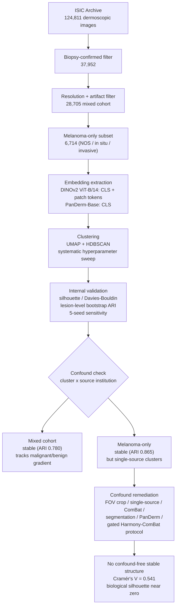

# Melanoma Subphenotype Discovery from Dermoscopy Image Tokenization

Unsupervised clustering of publicly available melanoma dermoscopy images in
vision-foundation-model embedding space. The question: do candidate image-based
melanoma **subphenotypes** exist beyond classical histopathological categories? And the
harder question this project ended up answering: does any such structure survive rigorous
control for **acquisition-source confounding**?

## Main findings

- **Mixed-diagnosis ISIC cohort (28,705 images).** UMAP + HDBSCAN clustering of DINOv2
  embeddings is stable (lesion-level bootstrap ARI 0.780 ± 0.204) — but the structure
  tracks the malignant/benign gradient, i.e. known diagnostic categories, not novel
  subphenotypes.
- **Melanoma-only cohort (6,714 images).** The most stable result (mean-pooled patch
  tokens, ARI 0.865 ± 0.181) initially looked clinically meaningful (small clusters at
  opposite ends of the in-situ/invasive spectrum) — but was driven almost entirely by
  dermoscope acquisition style and source institution, not lesion biology.
- **Eleven independent confound-control attempts** — FOV cropping, single-source
  restriction, ComBat harmonization, lesion segmentation, a second foundation model
  (PanDerm, trained across 11 clinical institutions), and a formally gated
  Harmony/ComBat protocol — all converge on the same conclusion:

  > **No stable, confound-free within-melanoma subphenotype structure is recoverable
  > from this ISIC-derived sample.** Cramér's V = 0.541 between source institution and
  > diagnosis means batch and biology are close to mathematically inseparable here, and
  > the biological silhouette score is near zero even before any correction.

- The confound-detection workflow and the gated harmonization protocol
  (see `harmonization/`) are offered as the methodological
  contribution: a template for future unsupervised foundation-model studies on
  multi-site medical imaging archives.

## Study scheme

The overall workflow, from cohort construction to the confound-controlled conclusion:



## Pipeline

1. **Cohort construction** (`data/preprocessing/`) — ISIC Archive metadata
   (124,811 rows) → biopsy-confirmed filter → 37,952 → resolution/artifact filter →
   **28,705 images**; melanoma-only subset (NOS / in situ / invasive) = **6,714**.
2. **Embedding extraction** (`embeddings/`) — frozen DINOv2 ViT-B/14 (no fine-tuning):
   768-d CLS token + 37×37×768 patch grid per image; PanDerm-Base (ViT-B/16) CLS
   embeddings for the domain-specific comparison.
3. **Clustering + internal validation** (`clustering/`) — systematic UMAP + HDBSCAN
   hyperparameter sweeps (54 to 980 configurations); per-run validation with silhouette,
   Davies–Bouldin, lesion-level bootstrap stability (100 × 80% subsamples, ARI; ≥ 0.6 =
   stable, pre-registered) and 5-seed sensitivity. All seeds fixed.
4. **Confound investigation** — cluster composition cross-tabulated against source
   institution (`attribution`) and diagnosis; five remediation families tested
   (cropping, single-source restriction, ComBat, segmentation, model substitution).
5. **Gated harmonization** (`harmonization/`) — protocol with a confounding gate
   (Cramér's V ≥ 0.35 forbids correction), a batch-signal gate, Shades-of-Gray color
   constancy, Harmony as primary correction, ComBat as sensitivity check, and a
   three-criterion acceptance gate; two independent gate-0 remediations (balanced
   subsampling, iterative source exclusion).

## Results at a glance

Bootstrap ARI across all fourteen clustering variants (100 lesion-level 80%
subsamples; stable ≥ 0.6):

| # | Run | n | Bootstrap ARI | Verdict |
|---|---|---|---|---|
| A | Mixed cohort, DINOv2 CLS | 28,705 | 0.780 ± 0.204 | stable (tracks diagnosis) |
| B | Melanoma-only, CLS (54-config sweep) | 6,714 | 0.488 ± 0.314 | unstable |
| C | Melanoma-only, CLS (980-config sweep) | 6,714 | 0.618 ± 0.228 | borderline |
| D | Melanoma-only, patch mean-pool (pre-crop) | 6,714 | 0.865 ± 0.181 | stable, confounded |
| E | Melanoma-only, patch (FOV-cropped) | 6,714 | 0.586 ± 0.278 | unstable |
| F | Single-source only: Hospital Clínic de Barcelona | 3,036 | 0.363 ± 0.195 | unstable |
| G | Single-source only: Anonymous | 1,661 | 0.211 ± 0.317 | unstable |
| H | DINOv2 + ComBat (attribution as batch) | 6,714 | 0.377 ± 0.126 | unstable |
| I | Lesion-segmented (mask-success artifact) | 6,714 | 0.999 ± 0.002 | artifact |
| J | Segmented, fallback images excluded | 6,448 | 0.347 ± 0.140 | unstable |
| K | PanDerm, pre-crop | 6,714 | 0.730 ± 0.178 | stable, confounded |
| L | PanDerm, cropped | 6,714 | 0.251 ± 0.281 | unstable |
| M | PanDerm + ComBat (raw) | 6,714 | 0.331 ± 0.199 | unstable |
| N | PanDerm + ComBat (cropped) | 6,714 | 0.504 ± 0.174 | unstable |

Gated harmonization (DINOv2 CLS, raw and cropped): both variants stop at the
confounding gate (Cramér's V = 0.541 ≫ 0.35). The two protocol-defined remediations
reach V = 0.33 / 0.31 on ~2,700-image cohorts but still fail the final gate; the
biological silhouette of the *uncorrected* embeddings is ~0.001–0.004 throughout.

## Repository structure

```
data/preprocessing/    cohort filters (biopsy, quality), FOV crop, segmentation
embeddings/            DINOv2 / PanDerm extraction scripts, mean-pool builders
clustering/            UMAP + HDBSCAN pipeline(s), validation, all variants
harmonization/         gated harmonization protocol scripts (gate 0–5, remediations A/B)
validation/            clinical/dermoscopic correlation scripts and results (JSON)
results/               harmonization evidence: gate results, metrics, reports
figures/               figure-generation scripts
```

## Reproducing the analysis

Environment: Python ≥ 3.10 with `torch`, `torchvision`, `umap-learn`, `hdbscan`,
`scikit-learn`, `scipy`, `pandas`, `numpy`, `matplotlib`, `seaborn`, `opencv-python`,
`neuroCombat` (harmonization only). Embedding extraction requires a GPU (a rented
RTX 4090 was used); clustering and validation run on CPU.

Data: images and metadata are **not** included in this repository. Download the
ISIC Archive images/metadata (`isic_all_dermoscopic.csv`, `ham10000_metadata.csv`)
into `data/raw/` and `data/metadata/`, then run, in order:

1. `data/preprocessing/filter_biopsy_confirmed.py` → `data/preprocessing/filter_quality.py`
   → `data/preprocessing/preprocess_images.py` (or the crop/segmentation variants)
2. `embeddings/extract_dinov2.py` (CLS + patch) and/or `embeddings/extract_panderm.py`
3. `clustering/run_clustering_pipeline*.py` (each variant has its own script)
4. `harmonization/build_inputs.py` + `gate0_confounding.py` + remediation scripts

Every step involving randomness takes a fixed `random_state`/`seed`; all seeds are
explicit in the scripts. Running a script twice with the same seed reproduces the
same result.

## What is not in this repository

- `manuscript/` — the manuscript under preparation is deliberately not published here.
- Raw/processed images, metadata CSVs, and all embedding binaries (regenerable via the
  scripts above from public ISIC data).
- Harmonization intermediate matrices and UMAP panels (regenerated by `harmonization/*.py`;
  the small gate/metric reports under `results/` are included).

## Citation

A manuscript describing this work is under preparation; a citation entry will be added
upon publication.

## License

This repository is licensed under the [MIT License](LICENSE). Note that the license
covers the code and documentation in this repository; the ISIC Archive images and
metadata referenced by the scripts remain subject to their own terms of use.
